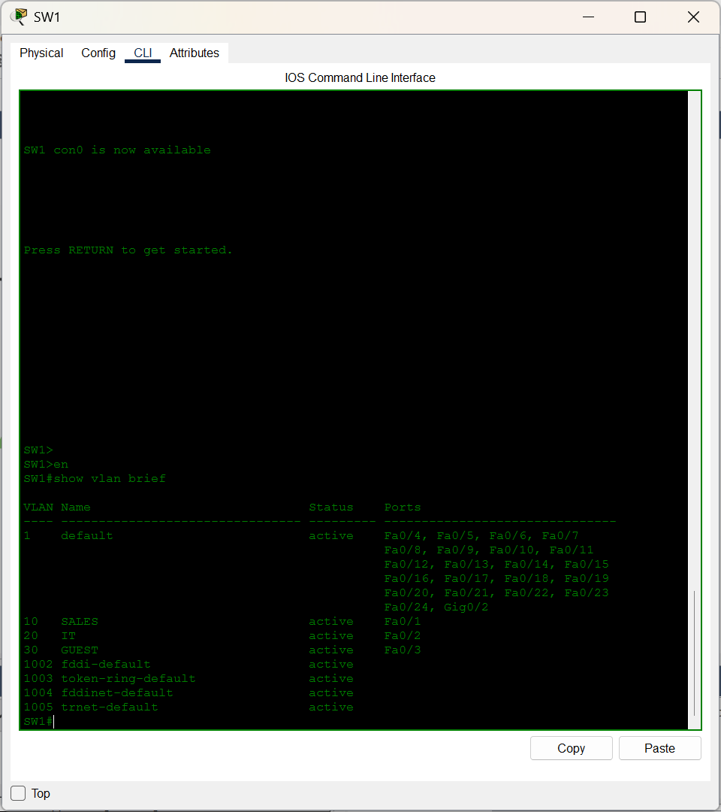
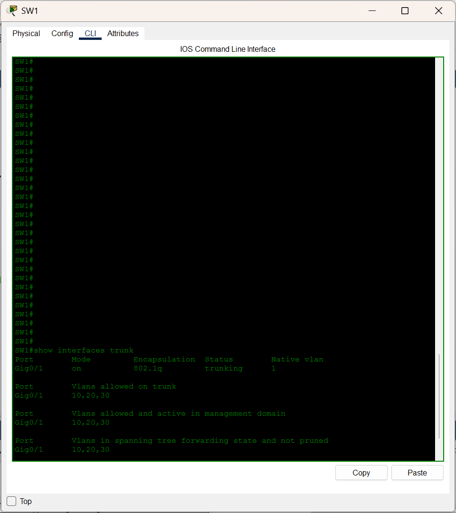
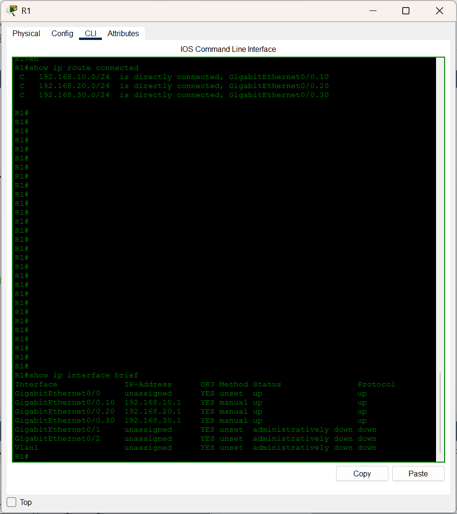
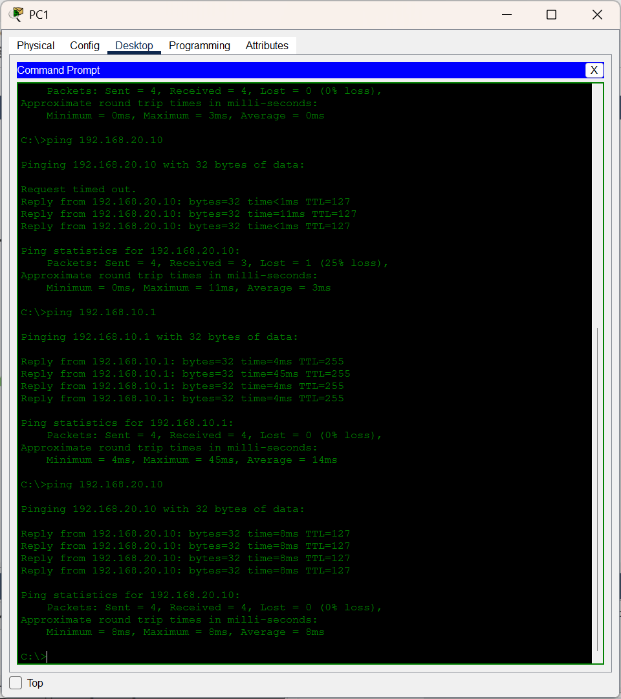
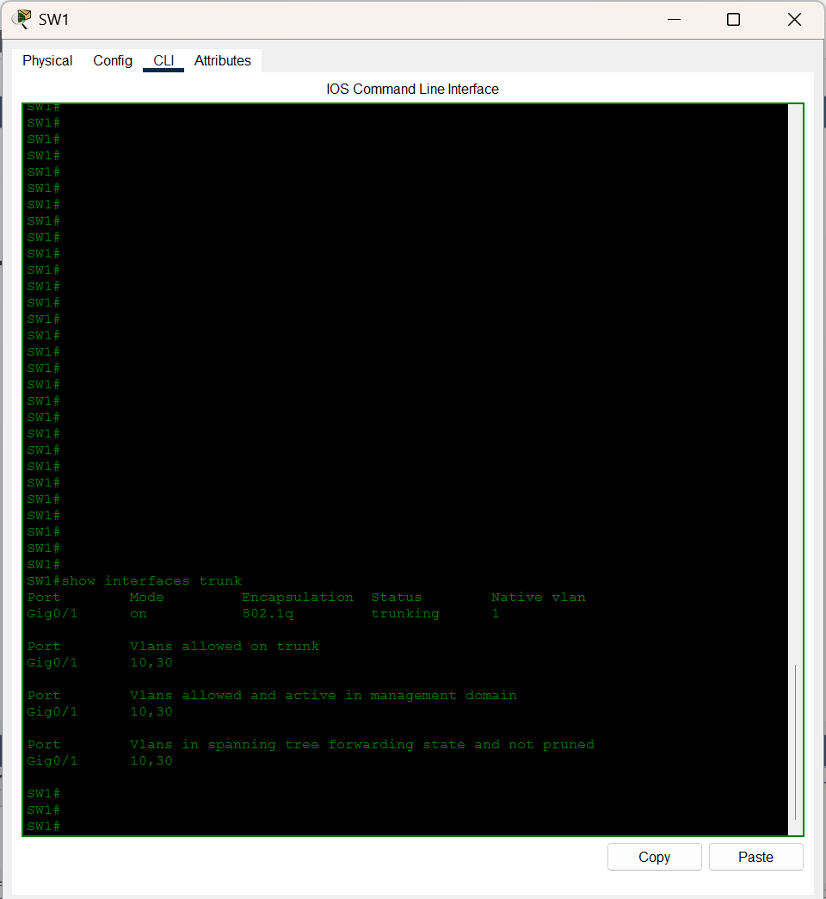
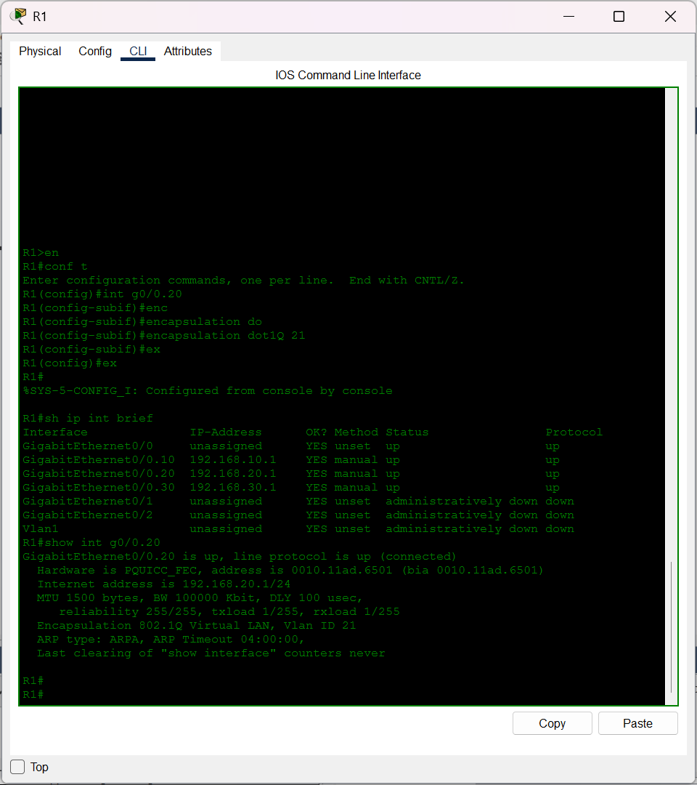

# Lab 01: VLAN & Inter-VLAN Routing (Router-on-a-Stick)

**Topics:** VLANs, 802.1Q trunking, Subinterfaces, Inter-VLAN routing  
**Tools:** Cisco Packet Tracer  
**Date completed:** September 2026

---

## What this lab is about

I built a small three-VLAN office network (Sales, IT, and Guest) on a 
single Layer 2 switch, then used a router with subinterfaces to route 
traffic between them. This is the classic "router-on-a-stick" design: one 
physical link between the switch and the router, split into three logical 
subinterfaces, each tagged for a different VLAN.

The point was to understand how VLANs isolate traffic at Layer 2 and how a 
single router interface can break that isolation in a controlled way when 
you want devices on different VLANs to talk.

---

## Topology


**Devices:**
- R1: router, three subinterfaces on Gi0/0
- SW1: Layer 2 switch
- PC1, PC2, PC3: one per VLAN

**Connections:**
- R1 Gi0/0 to SW1 Gi0/1 (802.1Q trunk)
- SW1 Fa0/1 to PC1 (VLAN 10)
- SW1 Fa0/2 to PC2 (VLAN 20)
- SW1 Fa0/3 to PC3 (VLAN 30)

**Addressing:**

| VLAN | Name  | Subnet            | Gateway        | PC      |
|------|-------|-------------------|----------------|---------|
| 10   | Sales | 192.168.10.0 /24  | 192.168.10.1   | PC1 .10 |
| 20   | IT    | 192.168.20.0 /24  | 192.168.20.1   | PC2 .10 |
| 30   | Guest | 192.168.30.0 /24  | 192.168.30.1   | PC3 .10 |

---

## How I built it

### On SW1: creating the VLANs

```
SW1(config)# vlan 10
SW1(config-vlan)# name SALES
SW1(config-vlan)# exit
SW1(config)# vlan 20
SW1(config-vlan)# name IT
SW1(config-vlan)# exit
SW1(config)# vlan 30
SW1(config-vlan)# name GUEST
SW1(config-vlan)# exit
```

Running `show vlan brief` after creating them confirmed VLANs 10, 20, and 
30 were all active and correctly named. At this point Fa0/1 through Fa0/3 
were still showing under VLAN 1, which makes sense because I hadn't 
assigned them yet.

### On SW1: access ports

```
SW1(config)# interface fa0/1
SW1(config-if)# switchport mode access
SW1(config-if)# switchport access vlan 10
SW1(config-if)# exit
```

Same pattern on Fa0/2 (VLAN 20) and Fa0/3 (VLAN 30).

Set each port explicitly to access mode. After assigning, `show vlan brief` 
showed Fa0/1 under VLAN 10, Fa0/2 under VLAN 20, and Fa0/3 under VLAN 30. 
VLAN 1 now only listed the unused ports and the two gigabit uplinks.

### On SW1: the trunk to R1

```
SW1(config)# interface gi0/1
SW1(config-if)# switchport trunk encapsulation dot1q
SW1(config-if)# switchport mode trunk
SW1(config-if)# switchport trunk allowed vlan 10,20,30
SW1(config-if)# exit
```

The `encapsulation dot1q` command isn't strictly necessary on a 2960 
running newer IOS, since 802.1Q is the only supported encapsulation. But 
it does no harm, so I left it in. `show interfaces trunk` confirmed Gi0/1 
was trunking with VLANs 10, 20, and 30 in the allowed, active, and 
forwarding columns.

### On R1: subinterfaces

```
R1(config)# interface gi0/0
R1(config-if)# no shutdown
R1(config-if)# exit

R1(config)# interface gi0/0.10
R1(config-subif)# encapsulation dot1Q 10
R1(config-subif)# ip address 192.168.10.1 255.255.255.0
R1(config-subif)# exit
```

Same pattern for `.20` and `.30` with their respective VLAN tags and 
gateway IPs.

The subinterface number is cosmetic. `Gi0/0.10` is just a label. What 
actually binds the subinterface to VLAN 10 is the `encapsulation dot1Q 10` 
line. Verified with `show ip interface brief` that the physical Gi0/0 
and all three subinterfaces were up/up. The physical interface has no IP 
address, which is correct, since it just carries the tagged frames.

### On the PCs

Static IPs, one per VLAN, with the gateway pointing to R1's matching 
subinterface. Full details are in `configs/` if needed.

---

## Verification

### VLANs exist on SW1



All three VLANs showed as active with the correct ports assigned. Fa0/1 in 
VLAN 10, Fa0/2 in VLAN 20, Fa0/3 in VLAN 30. No ports stuck in VLAN 1.

### Trunk is up and passing the right VLANs



Gi0/1 showed as `trunking` with VLANs 10, 20, and 30 in all three columns. 
The `allowed and active` column is the one that matters most, because a 
VLAN in "allowed" but not "active" means the VLAN doesn't exist in the 
database yet.

### Subinterfaces are up/up on R1



All four interfaces showed up/up. Gi0/0 had no IP address, which is 
correct, since it just carries the tagged frames. The three subinterfaces 
each had their correct gateway IP.

### End-to-end ping between VLANs



PC1 successfully pinged PC2 across VLANs. The first packet timed out 
(waiting for ARP), then the remaining four replies came back cleanly. This 
confirmed the whole path worked: PC1 to SW1 to R1 to SW1 to PC2, with the 
router correctly handling the inter-VLAN routing in the middle.

---

## Breaking it on purpose

### Break 1: Removed VLAN 20 from the trunk's allowed list

```
SW1(config)# interface gi0/1
SW1(config-if)# switchport trunk allowed vlan remove 20
```

**What happened:** PC2 lost all connectivity outside its own VLAN, 
including its default gateway at 192.168.20.1. PC1 and PC3 were completely 
unaffected.

**How I diagnosed it:** `show interfaces trunk` on SW1 showed VLAN 20 
missing from the allowed list on Gi0/1, even though `show vlan brief` 
still showed VLAN 20 as existing with Fa0/2 assigned. The contrast between 
those two outputs confirmed it was a trunk filtering issue, not a missing 
VLAN.

**Fix:** Re-added VLAN 20 with `switchport trunk allowed vlan add 20`.



### Break 2: Wrong dot1Q tag on the IT subinterface

```
R1(config)# interface gi0/0.20
R1(config-subif)# encapsulation dot1Q 21
```

**What happened:** PC2 couldn't reach its gateway at all, but 
`show ip interface brief` on R1 still showed Gi0/0.20 as up/up. The 
interface looked completely healthy.

**How I diagnosed it:** `show interfaces gi0/0.20` revealed the 
subinterface was tagged for VLAN 21, not VLAN 20. `show ip interface brief` 
doesn't show the VLAN tag, which is why the interface looked fine. This is 
a good reminder that a single show command never tells the whole story.

**Fix:** Reverted the tag to 20 with `encapsulation dot1Q 20`.



### Break 3: Wrong subnet mask on the Guest subinterface

```
R1(config)# interface gi0/0.30
R1(config-subif)# ip address 192.168.30.1 255.255.255.128
```

**What happened:** PC3 at 192.168.30.10 could still reach the gateway, but 
a device addressed at 192.168.30.140 could not. The /25 mask shrank the 
usable range without any obvious error.

**How I diagnosed it:** `show ip interface brief` showed the mask as 
255.255.255.128 instead of 255.255.255.0. IOS doesn't flag a wrong mask as 
an error. You have to read the mask column carefully and calculate the 
actual usable range.

**Fix:** Restored the mask to 255.255.255.0.

---

## What I took away from this lab

- The subinterface number is cosmetic. The `encapsulation dot1Q` command 
  is what actually binds a subinterface to a VLAN tag.

- A VLAN has to exist in the switch database before a port can be assigned 
  to it. Doing it in the wrong order fails silently.

- `show ip interface brief` can mislead you. It shows up/up even when a 
  subinterface is tagged for the wrong VLAN. To see the real story you 
  need `show interfaces` on the specific subinterface.

- Most "routing" problems between VLANs turn out to be Layer 2 trunk 
  filtering issues. `show interfaces trunk` is the first command to run 
  when inter-VLAN traffic breaks, before assuming it's a routing table 
  problem.

- The native VLAN being empty of user traffic isn't just convention. It's 
  a security best practice, because untagged traffic on a trunk is a known 
  VLAN-hopping vector.

---

## Files in this folder

- [`configs/R1-running-config.txt`](configs/R1-running-config.txt) : full running config from R1
- [`configs/SW1-running-config.txt`](configs/SW1-running-config.txt) : full running config from SW1
- `screenshots/` : verification and break outputs, numbered in order

---

fine for 
small networks and labs, but production enterprise cores usually use L3 
switches.
