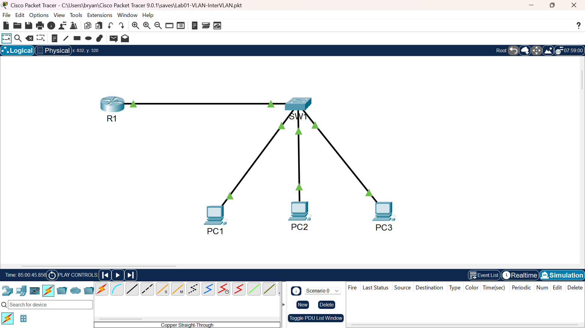

# Lab 01: VLAN & Inter-VLAN Routing (Router-on-a-Stick)

**Topics:** VLANs, 802.1Q trunking, Subinterfaces, Inter-VLAN routing  
**Difficulty:** Beginner  
**Tools:** Packet Tracer  
**Date completed:** March 2026

---

## What this lab is about

I built a small three-VLAN office network (Sales, IT, and Guest) on a 
single Layer 2 switch, then used a router with subinterfaces to route 
traffic between them. This is the classic "router-on-a-stick" design: one 
physical link between the switch and the router, split into three logical 
subinterfaces, each tagged for a different VLAN.

The point was to understand how VLANs isolate traffic at Layer 2 and how a 
single router interface can break that isolation in a controlled way when 
you want devices on different VLANs to talk.

---

## Topology

**Devices:**
- R1: router, three subinterfaces on Gi0/0
- SW1: Layer 2 switch
- PC1, PC2, PC3: one per VLAN

**Connections:**
- R1 Gi0/0 to SW1 Gi0/1 (802.1Q trunk)
- SW1 Fa0/1 to PC1 (VLAN 10)
- SW1 Fa0/2 to PC2 (VLAN 20)
- SW1 Fa0/3 to PC3 (VLAN 30)

**Addressing:**

| VLAN | Name  | Subnet            | Gateway        | PC      |
|------|-------|-------------------|----------------|---------|
| 10   | Sales | 192.168.10.0 /24  | 192.168.10.1   | PC1 .10 |
| 20   | IT    | 192.168.20.0 /24  | 192.168.20.1   | PC2 .10 |
| 30   | Guest | 192.168.30.0 /24  | 192.168.30.1   | PC3 .10 |

---

## How I built it

### On SW1: creating the VLANs
