# Lab 02: Static vs. OSPF Routing Comparison

**Topics:** Static routing, OSPFv2, administrative distance, convergence  
**Difficulty:** Intermediate  
**Tools:** Packet Tracer  


---

## What this lab is about

I built the same four-router chain topology twice: once with static routes, 
then again with single-area OSPF. Then I broke both versions in the same 
ways and compared how each responded.

The point was to see, not just read about, the trade-off between static 
routing and a dynamic protocol. Static is predictable but brittle. OSPF 
adds complexity but heals itself. Watching both fail side by side is what 
makes that trade-off real.

---

## Topology

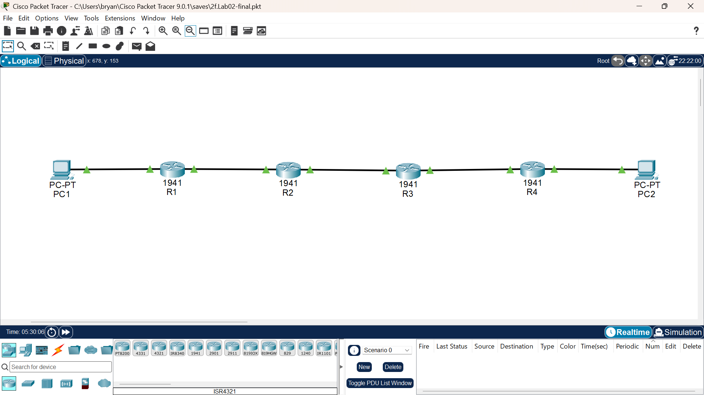

**Devices:**
- 4x Cisco 1941 routers: R1, R2, R3, R4 in a chain
- 2x PCs: PC1 (on R1's LAN), PC2 (on R4's LAN)

**Connections:**
- PC1 to R1 Gi0/0
- R1 Gi0/1 to R2 Gi0/0
- R2 Gi0/1 to R3 Gi0/0
- R3 Gi0/1 to R4 Gi0/0
- R4 Gi0/1 to PC2

**Addressing:**

| Link | Subnet | R1 | R2 | R3 | R4 |
|---|---|---|---|---|---|
| PC1 LAN | 192.168.1.0 /24 | .1 | | | |
| R1 to R2 | 10.0.12.0 /30 | .1 | .2 | | |
| R2 to R3 | 10.0.23.0 /30 | | .1 | .2 | |
| R3 to R4 | 10.0.34.0 /30 | | | .1 | .2 |
| PC2 LAN | 192.168.4.0 /24 | | | | .1 |

PC1: 192.168.1.10 /24, gateway 192.168.1.1  
PC2: 192.168.4.10 /24, gateway 192.168.4.1

---

## Phase A: Static Routing

### How I built it

Addressed every interface first, then added static routes on all four 
routers. R1 needed routes for every subnet it couldn't see directly, all 
pointing at R2's link address (10.0.12.2). R4 mirrored that, pointing at 
R3 (10.0.34.1). R2 and R3 needed routes in both directions.

Twelve static routes total across the four routers.

### Verification

**Static routing table on R1:**

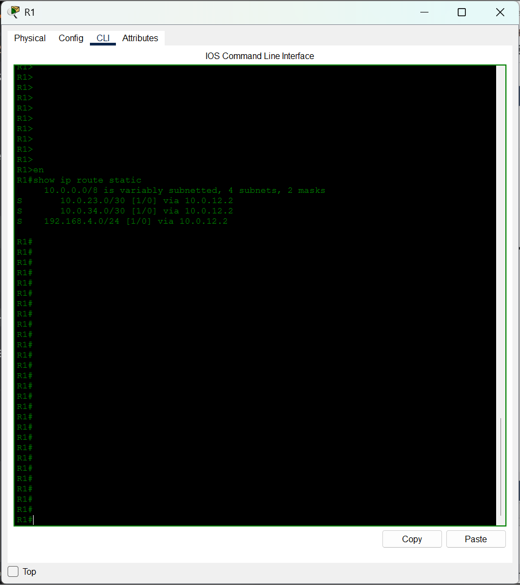

Three routes, each with administrative distance 1 and metric 0.

**End-to-end ping from PC1 to PC2:**

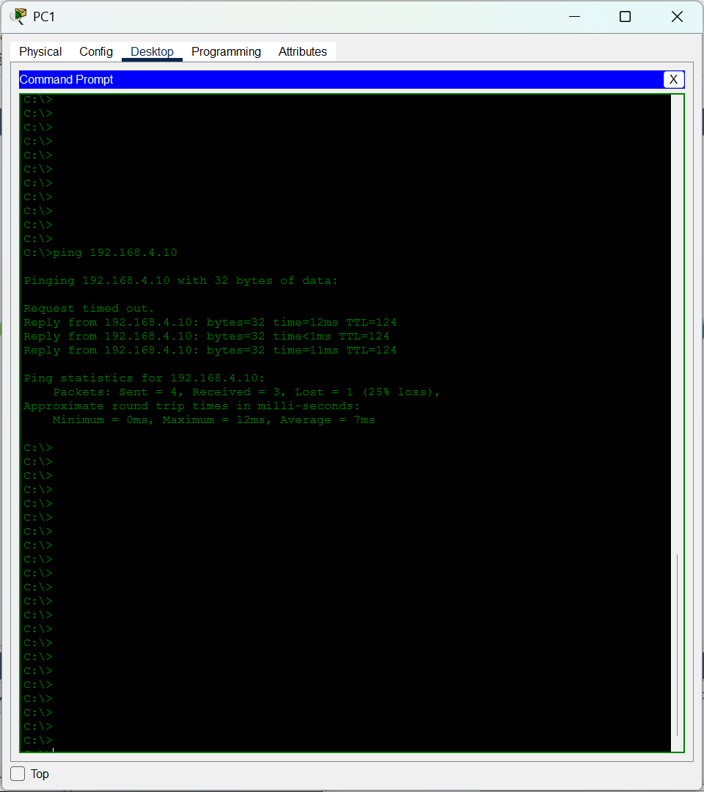

Once all twelve routes were in place, PC1 could ping PC2 across the whole 
chain.

### Break 1: Shut down R2's Gi0/1

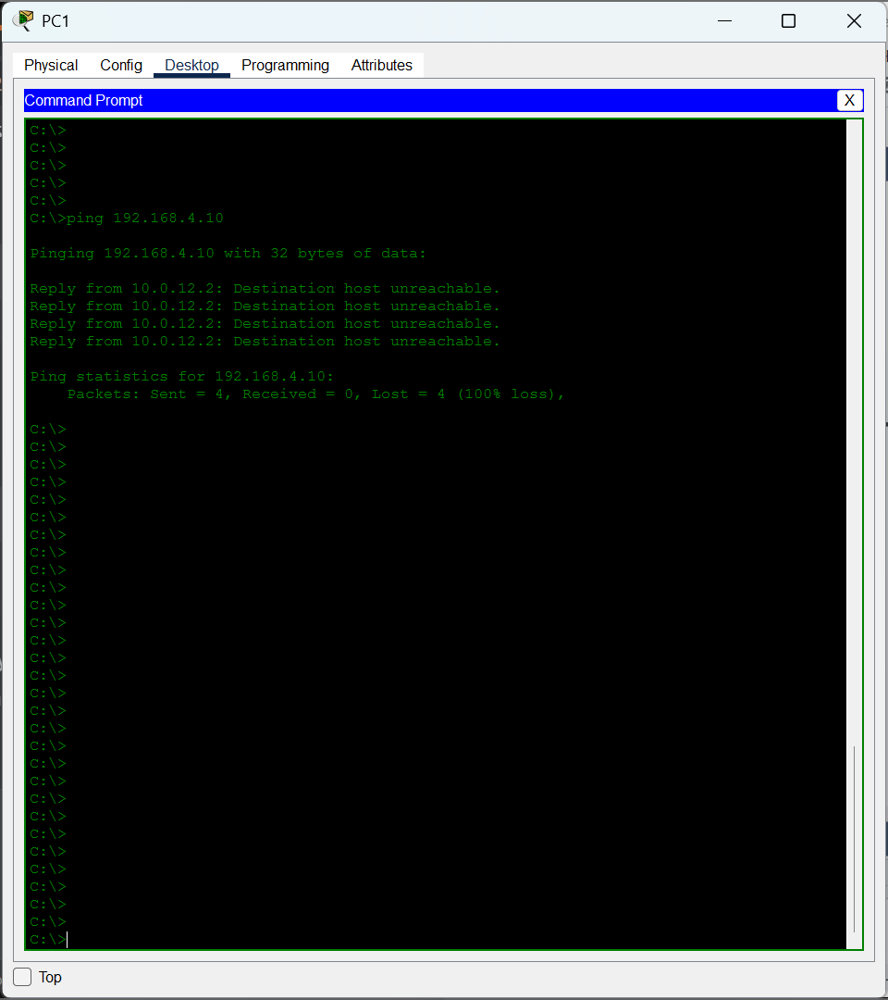

**What happened:** PC1 lost connectivity to PC2 entirely.

**What was interesting:** On R1, the static route to 192.168.4.0/24 
**stayed in the routing table**. It still pointed at 10.0.12.2, even though 
that next-hop was now downstream of a dead link. R1 had no way to know.

**Diagnosis:** `show ip route` on R1 showed the route still present. 
Pinging 192.168.4.10 failed with no useful error message.

**Fix:** Restore R2's Gi0/1. The route starts working again as soon as the 
interface is back up.

### Break 2: Remove a return route from R2

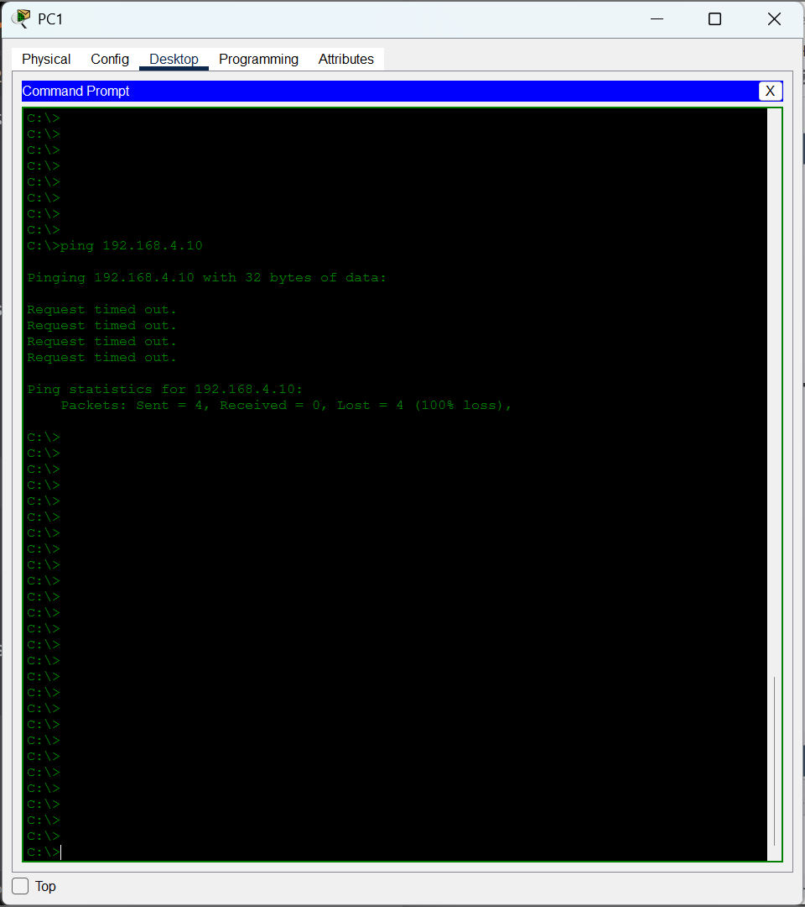

**What happened:** PC2 couldn't reach PC1's subnet, and PC1 couldn't reach 
PC2 either (because return traffic had nowhere to go).

**Diagnosis:** `show ip route static` on R2 was missing the route to 
192.168.1.0/24. Comparing R2's table to R1's made the asymmetry obvious.

**Fix:** Re-add the missing static route on R2.

### Break 3: Wrong next-hop on R1

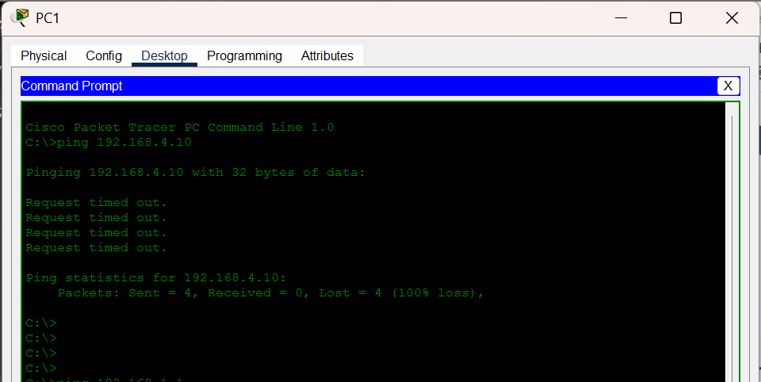

**What happened:** I changed R1's route to 192.168.4.0/24 to point at 
10.0.12.3 instead of 10.0.12.2. The ping still failed.

**What was interesting:** IOS **accepted the route**. The next-hop 
10.0.12.3 is technically within the /30 subnet range, so the router 
installed it. But no device answers at that address, so ARP resolution 
never succeeds and packets are silently dropped.

**Diagnosis:** The route looked valid in `show ip route`. The real evidence 
was in `show arp` on R1: no ARP entry for 10.0.12.3 after a ping attempt. 
The next-hop was a phantom.

**Fix:** Change the next-hop back to 10.0.12.2.

---

## Phase B: Single-Area OSPF

### How I built it

First, removed all twelve static routes. This is critical: static routes 
have administrative distance 1, OSPF has 110. If I'd left statics in place, 
they would have silently won every time and I wouldn't have been testing 
OSPF at all.

Then configured OSPF on each router:

```
router ospf 1
 router-id X.X.X.X
 network <subnet> <wildcard> area 0
```

Router IDs were set explicitly to avoid auto-selection surprises.

### Verification

**OSPF neighbors on R2:**

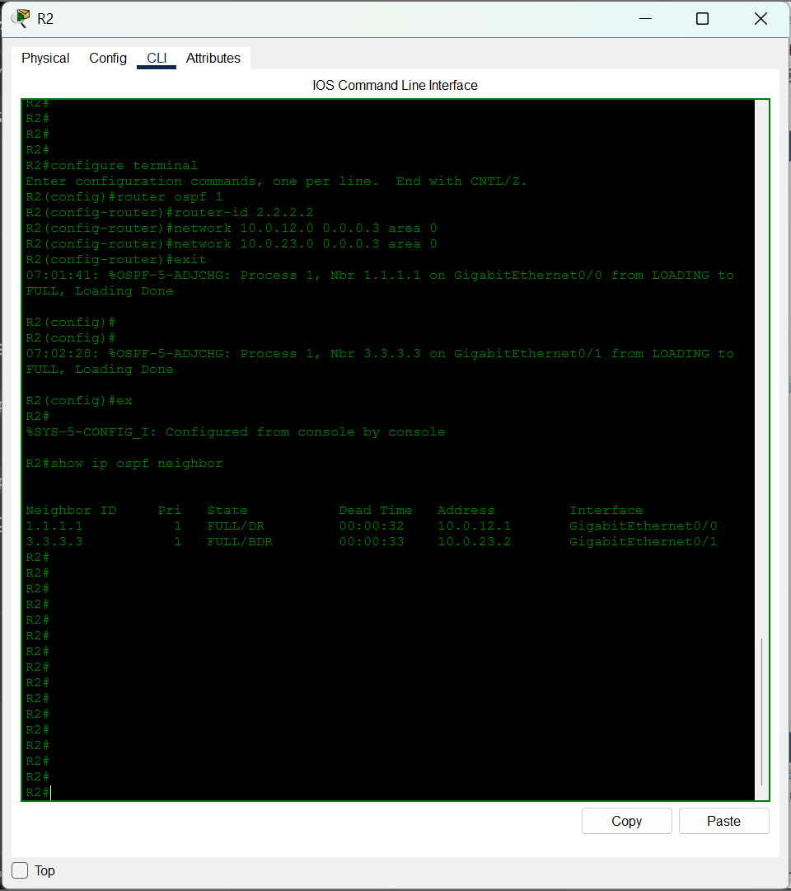

R2 sees R1 and R3, both `FULL`. Note that R1 and R4 only have one neighbor 
each, since they're at the ends of the chain. OSPF adjacencies only form 
between directly connected routers.

**OSPF routing table on R1:**

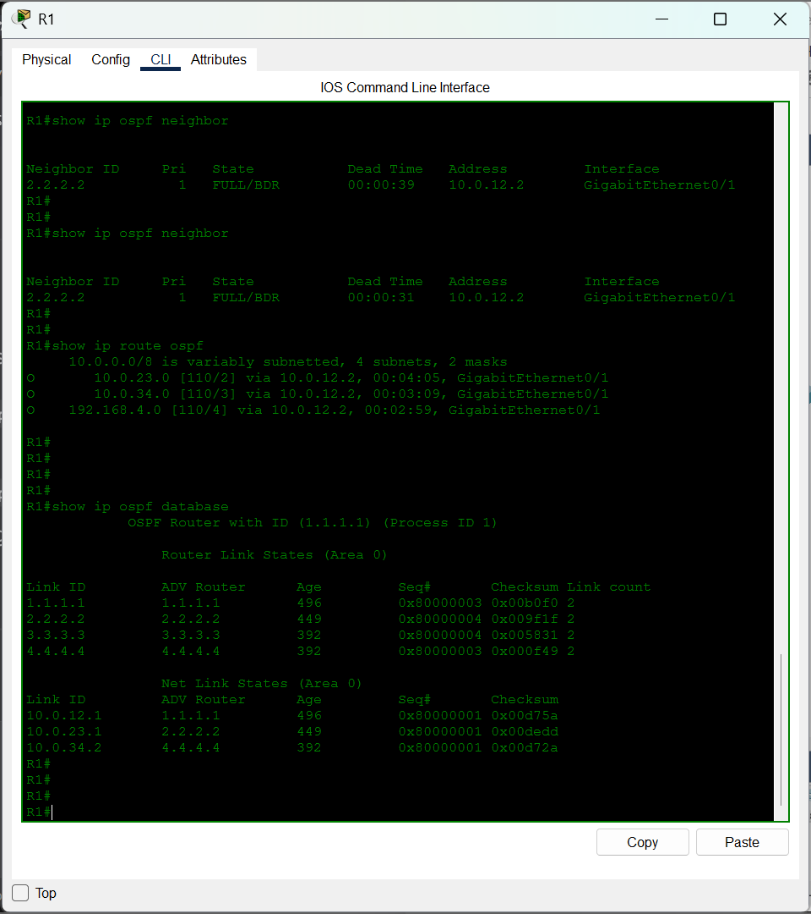

Three O-routes, all with administrative distance 110.

**End-to-end ping from PC1 to PC2:**

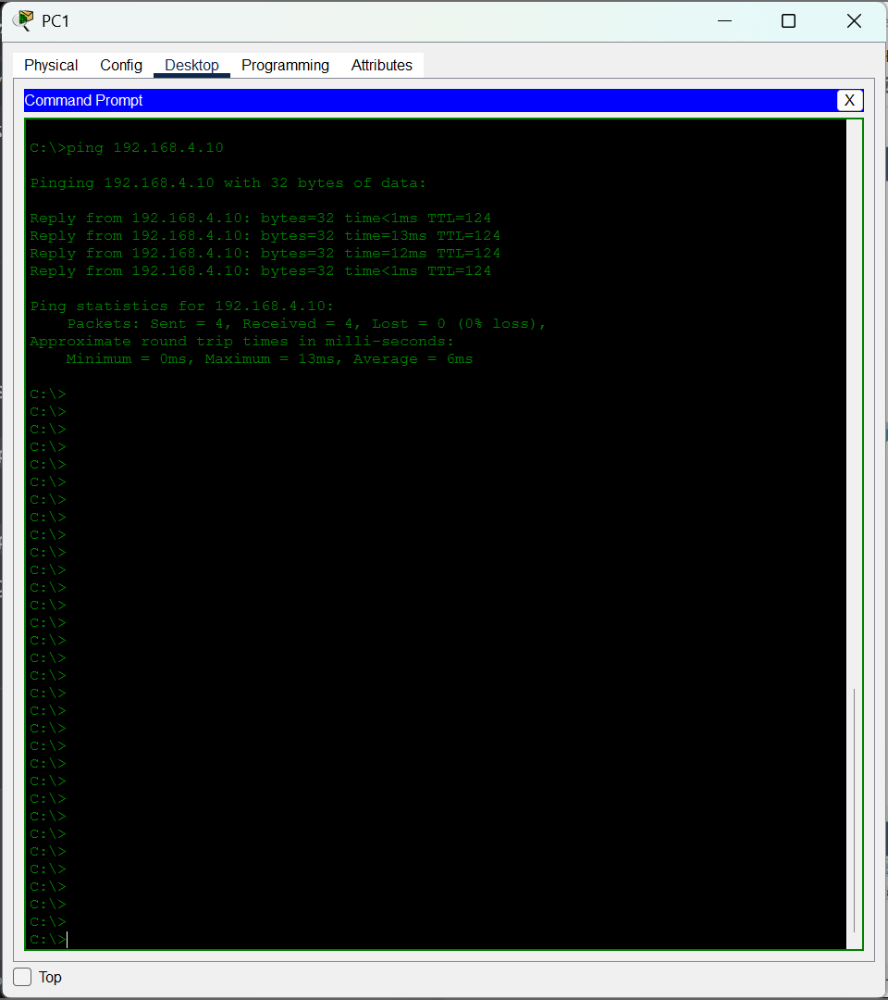

Same connectivity as static, achieved dynamically.

### Break 1: Shut down R2's Gi0/1

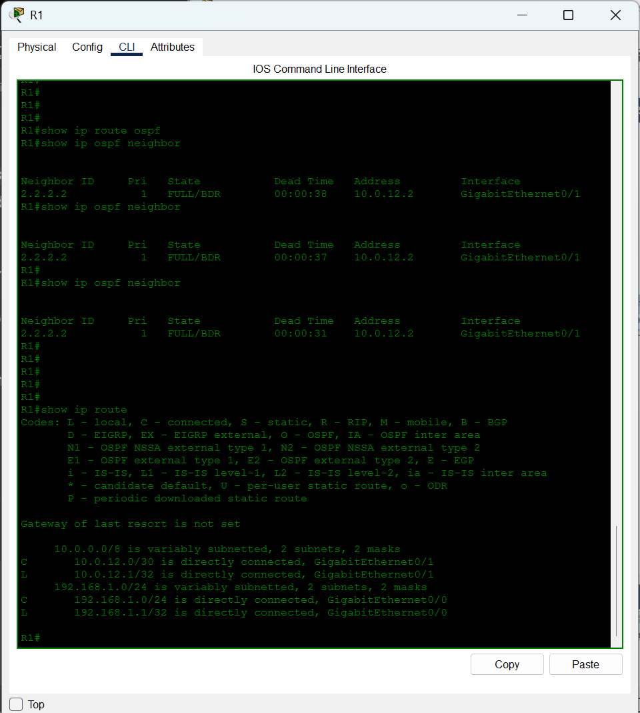

**What happened:** PC1 lost connectivity to PC2, same as with static.

**But the routing table was different:** On R1, the OSPF routes to 
10.0.34.0/30 and 192.168.4.0/24 **disappeared entirely** within seconds. 
OSPF detected the neighbor loss and withdrew the affected routes.

**This is the key difference the lab is about.** Static keeps the route and 
sends packets into a black hole. OSPF removes the route and stops trying.

**Fix:** Restore R2's Gi0/1. OSPF reconverges automatically within about 
40 seconds.

### Break 2: Mismatched OSPF area on R3

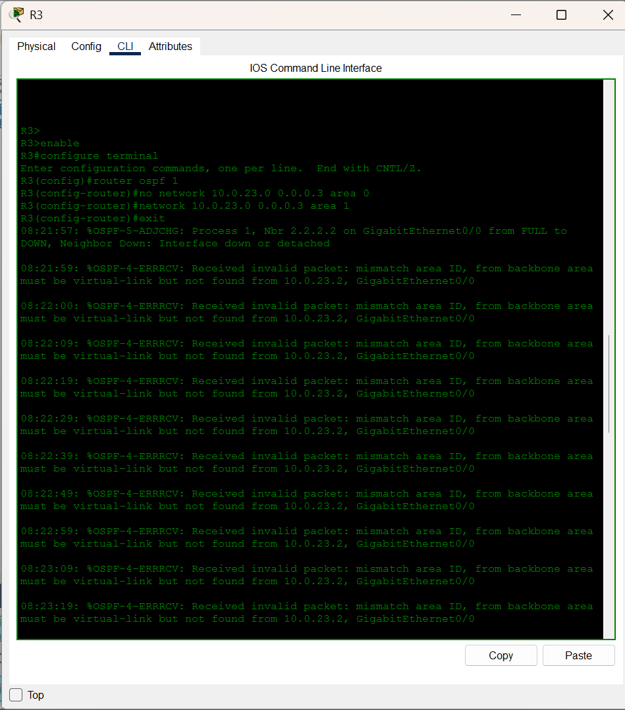

**What happened:** R3's link toward R2 was moved from area 0 to area 1. 
R2's side stayed in area 0. The adjacency between R2 and R3 failed to 
form, and PC1 lost connectivity to PC2.

**The log message:** The moment the fault was applied, this appeared on 
R3's console:

```
%OSPF-4-ERRRCV: Received invalid packet: mismatch area ID, from backbone 
area must be virtual-link but not found from 10.0.23.2, GigabitEthernet0/0
```

The log message told me exactly what was wrong. In a real troubleshooting 
scenario, `show logging` would catch this even if nobody was watching the 
console.

**Diagnosis:** `show ip ospf interface` on R2 showed Area 0.0.0.0. On R3 
it showed Area 0.0.0.1. Same command, two different answers.

**Fix:** Restore R3's interface to area 0.

### Break 3: Duplicate router ID

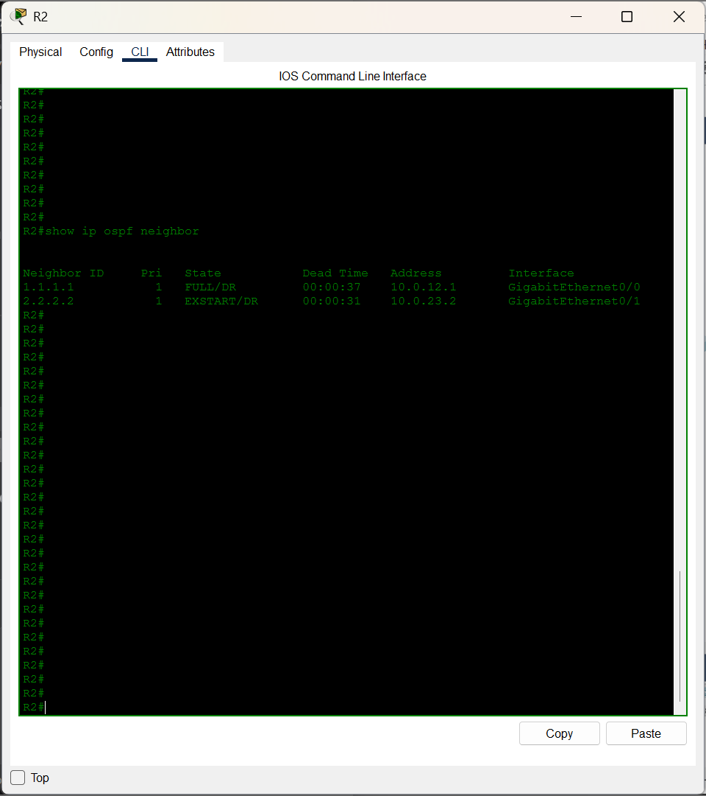

**What happened:** I changed R3's router ID to 2.2.2.2, matching R2's. 
The adjacency between R2 and R3 got stuck in `EXSTART` and never reached 
`FULL`.

**Why EXSTART specifically:** OSPF uses router ID to decide who becomes 
master during the database exchange. When two routers claim the same ID, 
neither can win the election, so the exchange never completes.

**Diagnosis:** On R2, `show ip ospf neighbor` showed a neighbor in 
`EXSTART` state with ID 2.2.2.2, the same as R2's own ID. Confirming with 
`show ip ospf` on both routers showed the same ID: 2.2.2.2.

**Fix:** Restore R3's ID to 3.3.3.3, then `clear ip ospf process` to force 
OSPF to re-read it.

### A leftover issue from Break 2

After fixing Break 2 and clearing OSPF, R3 was still reporting itself as an 
Area Border Router with two areas, even though its running config showed 
both networks in area 0.

This phantom Area 1 persisted through `clear ip ospf process`. The 
eventual fix was to remove the OSPF process entirely and rebuild it:

```
no router ospf 1
```

Then re-add the process and network statements. That cleaned out the stale 
internal state that the config commands hadn't touched.

Worth knowing: config changes aren't always enough to reset OSPF's internal 
state.

---

## The key comparison

| | Static routing | OSPF |
|---|---|---|
| Setup effort | High (12 routes for 4 routers) | Low (one process, two network statements per router) |
| Administrative distance | 1 | 110 |
| Detects link failures | No | Yes, within ~40 seconds |
| Withdraws dead routes | No | Yes |
| Self-heals | No | Yes, if an alternate path exists |
| Predictable | Yes, always | Mostly, but convergence timing varies |

Neither is "better." Static is right for small, stable topologies like a 
stub network with one exit point. OSPF is right for anything with more 
than a couple of routers, where a link failure needs to be handled without 
a human logging in.

---

## What I took away from this lab

- Static routes stay in the routing table even when their next-hop path is 
  dead. They don't detect failures. Traffic just silently disappears.

- OSPF withdraws routes within seconds of detecting a neighbor loss. This 
  is the whole reason dynamic protocols exist.

- Administrative distance, not metric, decides which routing source wins. 
  Removing static routes before configuring OSPF isn't optional.

- The OSPF `network` command activates OSPF on matching local interfaces. 
  It doesn't advertise remote networks. That's a common source of confusion.

- A stuck OSPF area in the database can persist through `clear ip ospf 
  process`. Sometimes you have to remove and rebuild the whole process.

- Router IDs must be unique. Duplicates cause specific, reproducible 
  failures like the EXSTART stuck state, not just vague weirdness.

---

## Files in this folder

- [`configs/R1-running-config.txt`](configs/R1-running-config.txt)
- [`configs/R2-running-config.txt`](configs/R2-running-config.txt)
- [`configs/R3-running-config.txt`](configs/R3-running-config.txt)
- [`configs/R4-running-config.txt`](configs/R4-running-config.txt)
- `screenshots/`: verification and break outputs for both phases

---

## If I were asked about this in an interview

**"When would you choose static routing over OSPF?"**

Static makes sense for small, stable topologies: a stub network with one 
exit point, or a specific route where you want total manual control. It has 
no protocol overhead, no CPU cost, and no convergence to worry about. But 
it doesn't scale, doesn't self-heal, and every change means logging into 
every router and re-typing routes. Once a topology gets past a couple of 
routers with redundant paths, OSPF or another dynamic protocol is the 
right call.

**"What does administrative distance do?"**

It ranks how trustworthy a routing source is when multiple sources know 
about the same destination. Static routes default to 1, OSPF to 110. Lower 
is more trusted. So if both static and OSPF know a route to the same 
subnet, the static one wins, even if it's stale. That's why you have to 
remove static routes before OSPF can take over for the same destinations.

**"What's the difference between how static and OSPF handle a link 
failure?"**

Static has no awareness of link state. If a route's next-hop becomes 
unreachable, the route stays in the table and packets get silently dropped. 
OSPF actively monitors neighbor state. When a neighbor stops responding, 
OSPF withdraws the affected routes and, if an alternate path exists, 
recalculates a new path to the same destinations. That's the entire pitch 
for dynamic routing in one sentence.
