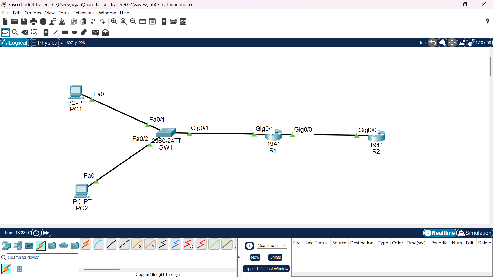
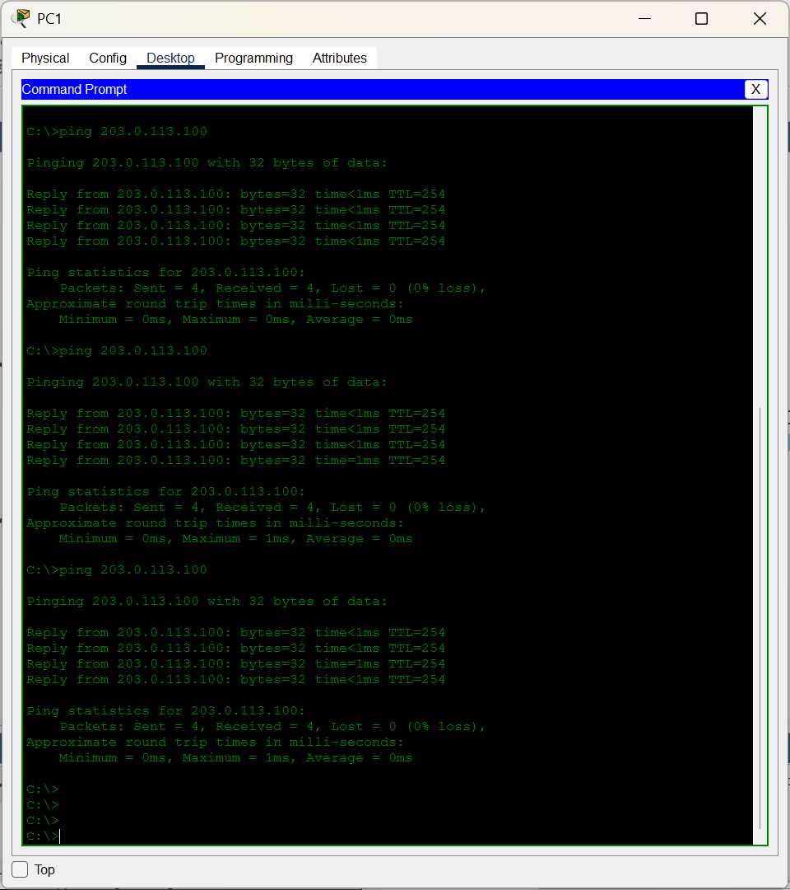
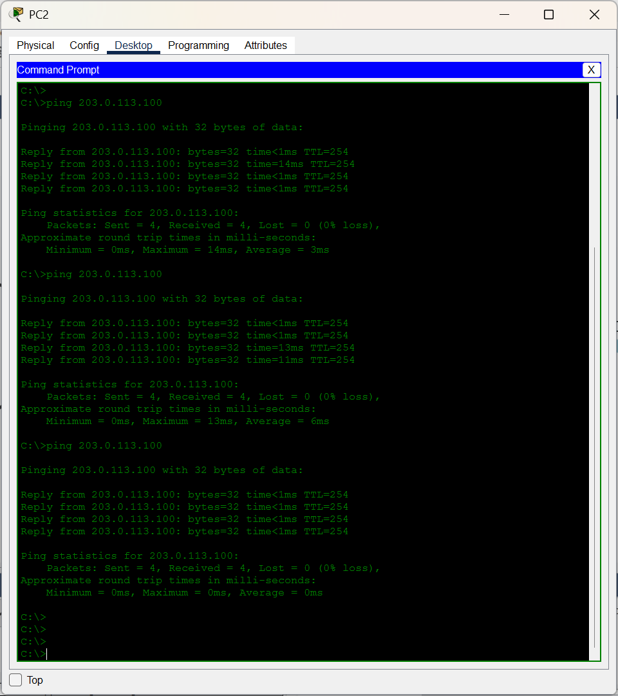
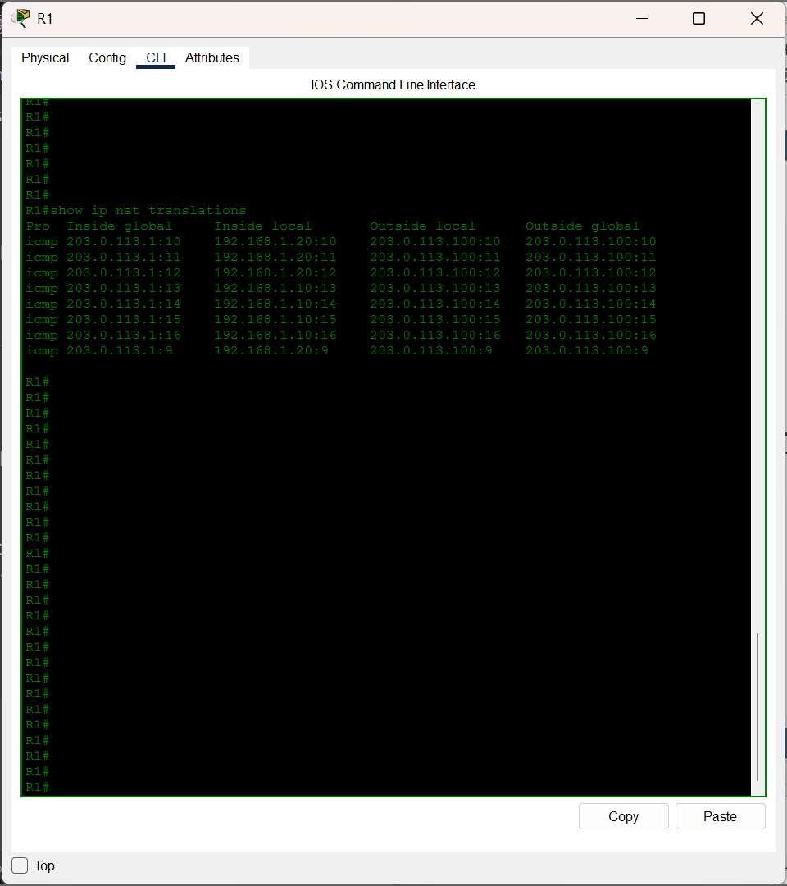
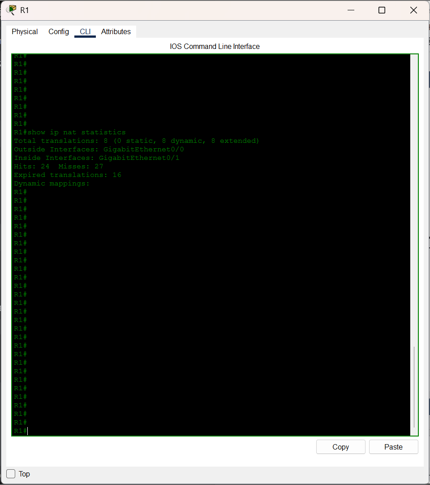
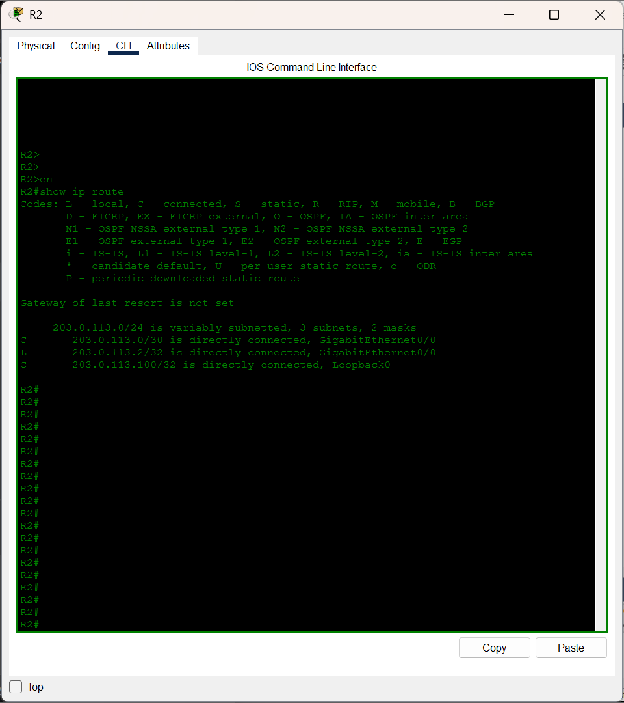
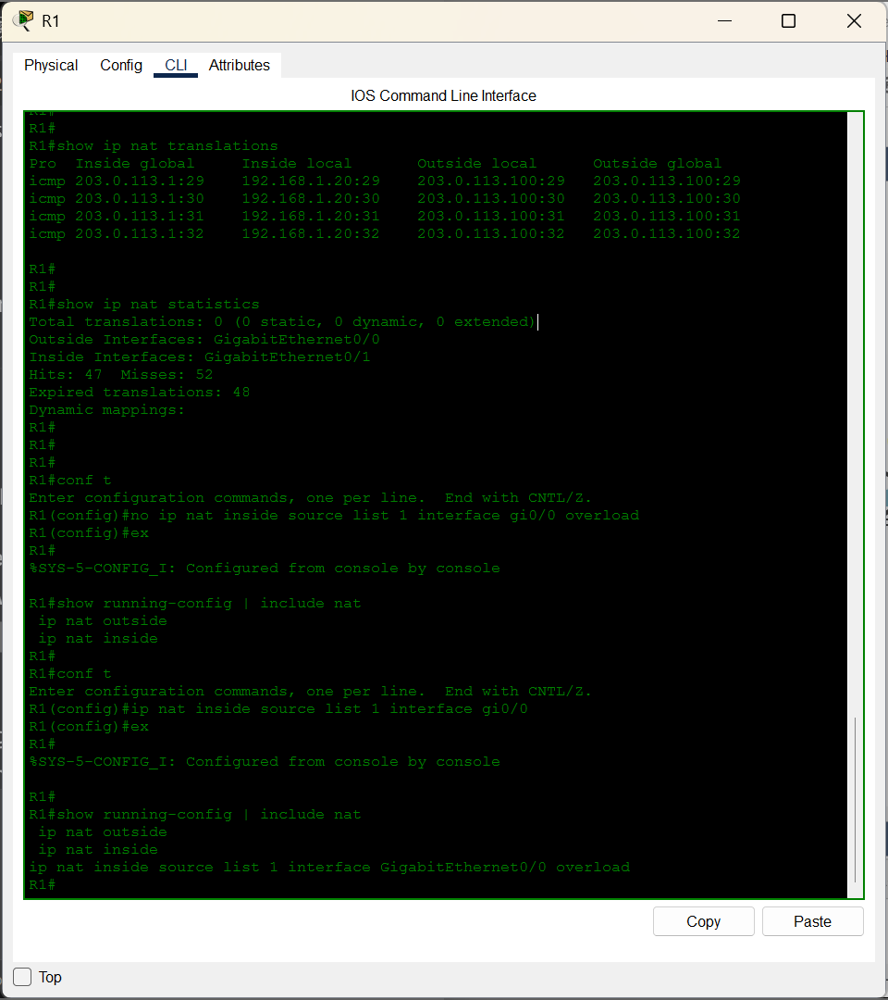
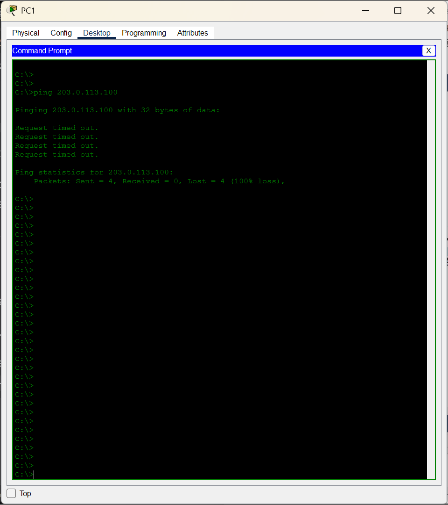
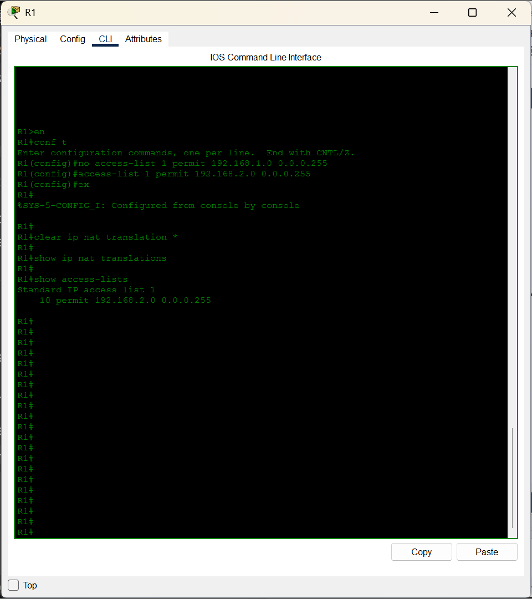
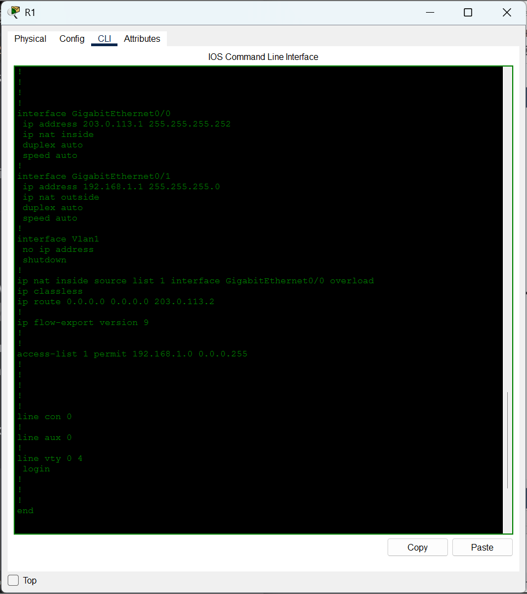

# Lab 03: NAT/PAT for Internet Access Simulation

**Topics:** NAT, PAT (overload), inside/outside interfaces, ACL-based translation matching 

**Tools:** Packet Tracer  

---

## What this lab is about

I configured Port Address Translation (PAT) on an edge router so that two 
internal hosts could share a single outside IP address for internet access. 
A second router with a loopback interface simulated the public internet, 
giving me a stable target to ping without needing a real connection.

The point was to see PAT working at the packet level: two different inside 
addresses, one outside address, distinguished by port number.

---

## Topology



**Devices:**
- R1: edge router, performs NAT. Inside interface faces the LAN, outside faces the ISP
- R2: simulated ISP router, loopback represents a server on the internet
- SW1: Layer 2 switch for the LAN
- PC1, PC2: internal hosts, both behind R1

**Connections:**
- PC1, PC2 to SW1
- SW1 to R1 Gi0/1 (inside)
- R1 Gi0/0 (outside) to R2 Gi0/0

**Addressing:**

| Segment | Subnet | Address |
|---|---|---|
| Inside LAN | 192.168.1.0 /24 | R1 Gi0/1: 192.168.1.1 |
| PC1 | | 192.168.1.10, gateway 192.168.1.1 |
| PC2 | | 192.168.1.20, gateway 192.168.1.1 |
| R1 to R2 | 203.0.113.0 /30 | R1 Gi0/0: 203.0.113.1, R2 Gi0/0: 203.0.113.2 |
| Internet server | 203.0.113.100 /32 | R2 Loopback0 |

The 203.0.113.0/24 block is TEST-NET-3, reserved by RFC 5737 for 
documentation. It behaves like public space but isn't routable on the 
real internet.

---

## How I built it

### Step 1: Address all interfaces

R1's Gi0/1 got the LAN gateway IP, Gi0/0 got the outside address facing R2. 
R2's Gi0/0 matched on the same /30, and its Loopback0 became the 
simulated internet server at 203.0.113.100.

### Step 2: Default route on R1

```
R1(config)# ip route 0.0.0.0 0.0.0.0 203.0.113.2
```

Without this, R1 has no way to reach anything beyond its directly 
connected subnets. Every packet headed to the simulated internet goes to 
R2.

### Step 3: Designate inside and outside

```
R1(config)# interface gi0/1
R1(config-if)# ip nat inside
R1(config-if)# exit

R1(config)# interface gi0/0
R1(config-if)# ip nat outside
R1(config-if)# exit
```

NAT is directional. Traffic arriving on an inside interface destined for 
an outside interface gets translated. Getting these backwards is a common 
mistake, and it fails silently (see Break 3).

### Step 4: ACL matching the inside subnet

```
R1(config)# access-list 1 permit 192.168.1.0 0.0.0.255
```

This ACL isn't filtering anything. It's being used to select which source 
addresses are eligible for translation. The "interesting traffic" 
concept. Context matters: same command, entirely different purpose from 
an ACL at a security boundary.

### Step 5: Enable PAT

```
R1(config)# ip nat inside source list 1 interface gi0/0 overload
```

The `overload` keyword turns this into PAT. Without it, dynamic NAT maps 
one inside address to one outside address at a time.

---

## Verification

### Both PCs reach the internet





Both inside hosts successfully pinged 203.0.113.100. Since R2 has no route 
back to 192.168.1.0/24, this only works because NAT is translating the 
source addresses.

### PAT in the translation table



Multiple entries, all sharing the same Inside global (203.0.113.1, R1's 
outside interface), with different Inside locals (192.168.1.10 and 
192.168.1.20) and different ports. That's the whole point of PAT in one 
screenshot.

### Statistics



The `extended` translations count confirms PAT is tracking ports, not just 
addresses.

### ISP has no knowledge of the private network



R2's routing table has no entry for 192.168.1.0/24. It only knows about 
the 203.0.113.0/30 link and its own loopback. Yet PC1 and PC2 can ping it. 
That's NAT actually hiding the private subnet.

---

## Breaking it on purpose

### Break 1: Removing the overload keyword (unexpected result)

I removed the `overload` keyword:

```
R1(config)# no ip nat inside source list 1 interface gi0/0 overload
R1(config)# ip nat inside source list 1 interface gi0/0
```

**What happened:** IOS silently re-added the `overload` keyword.

```
show running-config | include nat
ip nat inside source list 1 interface GigabitEthernet0/0 overload
```

**Why:** When the NAT target is an interface (rather than a pool of 
addresses), IOS assumes PAT is intended. The `overload` keyword is 
effectively mandatory with interface-based NAT.

**To actually configure dynamic NAT (one-to-one) instead of PAT,** you'd 
need an address pool:

```
ip nat pool PUBLIC 203.0.113.1 203.0.113.1 netmask 255.255.255.252
ip nat inside source list 1 pool PUBLIC
```

This is worth knowing: the break as described in most lab guides isn't 
achievable with interface-based NAT. The behavior is by design.



### Break 2: Wrong network in the NAT ACL

```
R1(config)# no access-list 1 permit 192.168.1.0 0.0.0.255
R1(config)# access-list 1 permit 192.168.2.0 0.0.0.255
```

**Symptom:** Neither PC could reach the internet. Complete failure.

**Diagnosis:** `show ip nat translations` was empty. `show access-lists` 
revealed the ACL was matching 192.168.2.0 instead of 192.168.1.0.

The signature here is specific: no translation entries at all. Nothing 
matched the ACL, so nothing got translated.





**Fix:** Restore the ACL to match 192.168.1.0/24.

### Break 3: Swapped inside and outside interfaces

```
R1(config)# interface gi0/1
R1(config-if)# no ip nat inside
R1(config-if)# ip nat outside
R1(config)# interface gi0/0
R1(config-if)# no ip nat outside
R1(config-if)# ip nat inside
```

**Symptom:** Same as Break 2. Neither PC could reach the internet.

**Diagnosis:** This is where it gets interesting. The visible symptom is 
identical to Break 2, but the cause is different.

- `show ip nat translations` was empty (same as Break 2)
- `show access-lists` showed ACL 1 was correct (rules out Break 2)
- `show running-config` revealed the actual issue: Gi0/1 (facing the LAN) 
  was tagged `ip nat outside`, and Gi0/0 (facing the ISP) was tagged 
  `ip nat inside`. Both backwards

NAT only translates traffic arriving on an inside interface. With the 
tags swapped, traffic from the LAN arrives on an "outside" interface 
and NAT ignores it entirely.



**Fix:** Swap the designations back to the correct interfaces.

---

## What I took away from this lab

- PAT lets many inside hosts share one outside address by translating 
  source ports along with source addresses. Two hosts, one IP, different 
  ports.

- The NAT ACL isn't a filter. It's a selector. It defines which traffic 
  is eligible for translation. An empty translation table with traffic 
  flowing usually means the ACL isn't matching the source subnet.

- NAT is directional. Inside and outside interface designations matter, 
  and getting them backwards fails silently.

- The `overload` keyword is effectively mandatory when using 
  interface-based NAT. IOS re-adds it silently if you try to remove it. 
  To configure true one-to-one dynamic NAT, you need a pool.

- NAT translation entries are reactive. An empty `show ip nat 
  translations` before any traffic is expected, not a fault.

- Two different faults (wrong ACL, swapped interfaces) can produce 
  identical visible symptoms. The diagnostic path diverges only when you 
  check the right commands in the right order.

---

## Files in this folder

- [`configs/R1-running-config.txt`](configs/R1-running-config.txt)
- [`configs/R2-running-config.txt`](configs/R2-running-config.txt)
- `screenshots/`: topology, verification, and break outputs

---

